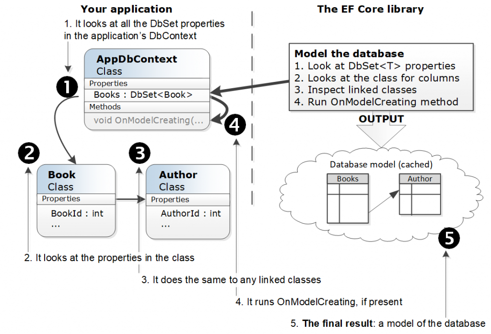
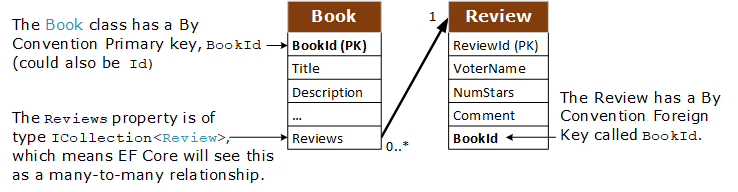

EF Core Tips and techniques
===========================

Reading from the database
-------------------------

How EF Core represents data when reading from the database
^^^^^^^^^^^^^^^^^^^^^^^^^^^^^^^^^^^^^^^^^^^^^^^^^^^^^^^^^^

When you query a database EF Core goes thought various steps to convert from data returned by the database into entity 
classes with navigational links filled in. In this section we will look at those steps for two types of queries – a normal 
query, i.e. without ``AsNoTracking``, also known as a read-write query, and a query with the ``AsNoTracking`` method added 
known as a read-only query.

But first we look at the initial part which takes your LINQ command, converts it to the relevant commands for the database 
type you are using, and gets the data back. This is common to the two types of query we are going to look at. See the 
following figure for this first part.

.. image: ../_static/EF-Core-in-depth-first-part-of-the-query-1024x497.png

There is some very complex code that converts your LINQ into database commands, but there really isn’t a lot to say other 
than if your LINQ can’t be translated you will get an exception from EF Core with a message that contains ‘could not be translated’. 
Also, when the data is coming back features like Value Converters may adapt the data.

This section has shown the first part of the query, where your LINQ is turned into database commands and returns all the correct 
values. Now we look at the second part of the query where EF Core takes the returned values and turns them into instances of the 
entity classes and filling in any navigational properties. There are two types of queries which we will look at.

1. A normal query, read-write query
~~~~~~~~~~~~~~~~~~~~~~~~~~~~~~~~~~~

A normal query reads in the data in such a way that the data can be edited, which is why I refer to it as a read-write query. It 
doesn’t automatically update data, but unless your query read-write then you won’t be about to update the data you have just read in.

The example I gave you in the introduction does a normal query that reads in the four example books with the links to their authors. 
Here is the query code part of that example

.. code-block:: csharp

    var books = context.Books
        .Include(r => r.AuthorsLink)
            .ThenInclude(r => r.Author)
        .ToList();

Then EF Core goes through three steps to convert those values back into entity classes with navigational properties filled in. The 
figure below shows the three steps and the resulting entity classes with their navigational links.

.. image: ../_static/EF-Core-in-depth-normal-query-1024x730.png

1. **Create classes and fill in data**. This takes the values that came back for the database and fills in the non-navigational 
   (known as scalar) properties, fields, etc. In the Book entity class this would be properties like BookId (Book’s primary key), 
   Title, etc. – see bottom left, light blue rectangles.
   There can be a lot of other issues around here, such as how EF Core used constructors, backing fields, shadow properties, 
   adapting data, client-side calculations to name but a few.
2. **Relational fixup**. The first step will have filled in the primary keys and foreign keys, which define how the data is connected 
   to each other. EF Core then uses these keys to set up the navigational properties between the entity classes (shown as thick blue 
   lines in the figure).
   This Relational fixup’s linking feature goes beyond the entity classes just read in by the query, it looks at every tracked entity 
   in the DbContext and fills in any navigational properties. This is a powerful feature, but if you have lots of tracked entities 
   then it can take some time – that’s why the AsNoTracking query exists, to be quicker.
3. Creating a **tracking snapshot**. The tracking snapshot is a copy of the entity classes that are passed back to the user, plus 
   other things like a link to each entity class that it shadows – an entity is said to be tracked, which means it can be used in 
   database writes.

2. An ``AsNoTracking`` query, which has the ``AsNoTracking`` method added, read-only query.
~~~~~~~~~~~~~~~~~~~~~~~~~~~~~~~~~~~~~~~~~~~~~~~~~~~~~~~~~~~~~~~~~~~~~~~~~~~~~~~~~~~~~~~~~~~

Writing to the database
-----------------------

Configuring EF Core
-------------------

While configuring a DbContext is really important there can be a lot of configuration code. This article pulls together lots 
of configuration approaches to minimise or automate much of the EF Core configurations.

What is happening when you configure your DbContext
^^^^^^^^^^^^^^^^^^^^^^^^^^^^^^^^^^^^^^^^^^^^^^^^^^^

To use EF Core you must create a class that inherits EF Core’s DbContext. In this class you add DbSet<T> properties that 
set up the mapping between your entity classes and the database. The following listing is a very basic application DbContext 
without any extra configuration.

.. code-block:: csharp

    public class EfCoreContext : DbContext 
    {
        public EfCoreContext(DbContextOptions<EfCoreContext> options)                    
            : base(options) {}                                         
    
        public DbSet<Book> Books { get; set; }                      
        public DbSet<Author> Authors { get; set; }                  
        public DbSet<PriceOffer> PriceOffers { get; set; }          
    }                 

When I talk about “*configuring EF Core*”, or “*configure your DbContext*” I’m talking about a process the EF Core does on the 
first use of your application’s DbContext. At that point is creates a Model of the database you plan to access based on your 
entity classes mapped to the database and any EF Core configuration commands you have provided.

Just to be clear, it never looks at the actual database to build this Model; it only uses the entity classes and any EF Core 
configuration commands you have added. How EF Core’s Model of the database and the actual database need to match otherwise 
your application will fail when it tried to access the database.

The following figure shows the process that EF Core goes through the first time you use your application’s DbContext 
(later instances of your DbContext use a cached version of the created Model).

EF Core uses three ways to pick up configure information

* **By Convention**: When you follow simple rules on property types and names, EF Core will auto-configure many of the 
  software and database features. For instance:
  * A property of NET type *string* will, by default, map to SQL ``NVARCHAR(max) NULL``
  * A property with the name ``Id`` or ``<ClassName>Id`` (e.g. BookId) will be the primary key for this entity class.
* **Data Annotations**: A range of .NET attributes, known as Data Annotations, can be added to entity classes and/or 
  properties to provide extra configuration information. For instance:
  * Adding the attribute ``[MaxLength(100)]`` on string property will change the SQL to ``NVARCHAR(100) NULL``
  * Adding the attribute ``[Required]`` on string property will change the SQL to ``NVARCHAR(max) NOT NULL``.
* **Fluent API**: EF Core has a method called ``OnModelCreating`` that’s run when the EF context is first used. 
  You can override this method and add commands, known as the Fluent API. For instance:
  * The command ``modelBuilder.Entity<Book>().Property(p => p.Price).HasIndex()`` would add a non-unique index
    to the Price column in the table mapped to the Book entity class.
  * The command ``modelBuilder.Entity<Book>().Property(p => p.PublishedDate).HasColumnType(“date”)`` would change 
    the SQL type from ``DATETIME2``, which has a resolution of 100ns, to the much smaller SQL DATE type that is 
    accurate to the one day.

Read on for tips on how to use these three approaches to a) write the minimum of configuration code and b) get a 
good database design.

.. Tip: Let EF Core do most of the configuring using By Convention rules

Most of you will already be using the By Convention rules to set up the column names and types. If you are control 
over the database design, known as its schema, i.e. you can use whatever column names that suit you, which will save 
you from writing a lot of boring configuration code.

By when it comes to relationships some developers seem to what to define every relationship. When I first started 
using EF6 I did just that, but ended up with a lot of code! Once I understood EF Core’s By Convention rules then 
I rarely defined a relationship unless I want to change the delete behaviour. The relationships rules are pretty simple:

1. Name your primary key as ``Id`` or ``<ClassName>Id`` (e.g. BookId).
#. Use the ``<ClassName>Id`` name on your foreign key, because that works with both primary key formats, i.e. ``Id`` or ``<ClassName>Id``
#. Set up the property that links the two entity classes (known as navigational property) using the entity class 
   type (the name doesn’t matter), e.g. ``ICollection<Review> Reviews { get; set; }``

Here is a figure showing a relationship that EF Core’s By Convention will define automatically.

Of course, there are some exceptions where you would need Fluent API commands.

* EF Core can only configure a one-to-one relationship By Convention if both ends of the have navigational properties, 
  otherwise it will think it’s a one-to-many relationship. But one-to-one relationships are a lot less used than 
  one-to-many and many-to-many relationships.
* If you want to change the delete rules from the By Convention value; for instance, what happens to the Reviews 
  when the Book is deleted – in this case the Reviews would be deleted too. If you didn’t want that to happen then 
  you would have to define the relationship using Fluent API commands and add the OnDelete command.
* If you have two navigational properties going to the same class, for instance BillingAddress and DeliveryAddress 
  both pointing to the Address entity class, then you do need to configure that manually (but an Owned type would 
  be better for that).
* Some very advanced things like setting the constraint name need Fluent API

Overall you want to let EF Core configure as much as you can as its quick and easy. So, learn the rules and 
trust in EF Core but unit tests are also good.

Making your database more efficient
^^^^^^^^^^^^^^^^^^^^^^^^^^^^^^^^^^^

Its easy to create classes, but entity classes need a little more attention to make sure the database is as fast 
as it can be. This requires a bit more work on your part. Here are some things to consider

1. string type properties
~~~~~~~~~~~~~~~~~~~~~~~~~

By default, will set the SQL type to ``NVARCHAR(MAX) NULL`` works OK, but do you need space for a 1Gbyte Unicode 
character string? Here are some suggestions:

* Set the size of the string using ``[MaxLength(123)]`` attribute. ``NVARCHAR(NNN)`` is slightly quicker than 
  ``NVARCHAR(MAX)`` and ``NVARCHAR(NNN)``
.. NOTE: The ``[MaxLength(123)]`` is also useful for front-end checking that the input isn’t too long.

* If you filter or sort on a string, then adding an SQL index is useful. Use Fluent API command ``HasIndex()`` or the new 
  EF Core 5 ``[Index(nameof(Title)]`` attribute. 
.. NOTE: An index has a limit of 900 bytes, so your ``NVARCHAR`` must be 450 or lower.

* Some strings are 8-bit ASCII, like URLs, so why send/return the other bytes. Use Fluent API command ``IsUnicode(false)``, 
  which will turn the SQL type from ``NVARCHAR`` to ``VARCHAR``.

* Try adding the ``[Required(AllowEmptyStrings = false)]`` attribute on strings you expect to contain a string. The ``[Required]`` 
  part will change the SQL type from ``NVARCHAR(MAX) NULL`` to ``NVARCHAR(MAX) NOT NULL`` 
  the AllowEmptyStrings = false part doesn’t affect the database; it is only used in any NET validations.

2. DateTime type properties
~~~~~~~~~~~~~~~~~~~~~~~~~~~

By default, NET’s DateTime type is saved as SQL ``DATETIME2``, which has a resolution of 100ns and take up 7 bytes. In some 
cases that is great, but SQL ``DATE`` type is only 3 bytes. As well as saving bytes a sort or filter of a ``DATE`` type is 
going to be much quicker sort/filter than on a ``DATETIME2`` type.

.. NOTE: If you save a DateTime that is using DateTimeKind.Utc, then you should know that the DateTimeKind of a DateTime 
   is not preserved in the database. That matters if your front-end is going to send the data using JSON, as the JSON datatime 
   string won’t end with a “Z” and your front-end might get the date offset right. You can fix this using EF Core’s 
   ValueConverters – add a comment to this article if you want to know how to do that.

3. decimal type properties
~~~~~~~~~~~~~~~~~~~~~~~~~~

By default, a NET decimal type is saved as ``DECIMAL(18,2)``, which is SQL Servers default, which means it has 16 digits before 
the decimal point and 2 after the decimal point and takes up 9 bytes. If your dealing with money that might be too big, 
and ``DECIMAL(9,2)`` would work and that’s only 5 bytes.

On the other hand, if you’re dealing with percent, then having a precision of 2 decimal places might not be enough, and 16 digits 
before the decimal point is too much.

In both cases its worth changing the default precision, i.e. number of digits stored, and scale, i.e. number of digits after the 
decimal point. You can do that via the ``[Column(Datatype=”decimal(9,2)”)]`` or the Fluent API command ``HasColumnType(”decimal(9,2)”)`` 
command. But in EF Core 5 there is a really nice Fluent API called ``HasPrecision(9,2)``, which is easier.

4. Avoid expression body properties with EF Core
~~~~~~~~~~~~~~~~~~~~~~~~~~~~~~~~~~~~~~~~~~~~~~~~

In a normal class having a property where it has code referred to as expression body definition as shown below is the right thing to do.

.. code-block:: csharp

    public class MyClass
    {
        public string FirstName { get; set; }
        public string LastName { get; set; }
    
        public string FullName => $"{FirstName} {LastName}";
    }

The problem comes when you want to sort/filter on the FullName – EF Core will throw an exception because there is no FullName column 
to sort/filter on. So you need to add an actual FullName property that will be mapped to the database, and you either set the properties 
via a constructor, or use EF Core’s backing fields to capture a software change to the FirstName/LastName and set the FullName

.. code-block:: csharp

    public class MyClassImproved
    {
        private string _firstName;
        private string _lastName;
    
        public string FirstName
        {
            get => _firstName;
            set
            {
                _firstName = value;
                FullName = $"{FirstName} {LastName}";
            }
        }
    
        public string LastName
        {
            get => _lastName;
            set
            {
                _lastName = value;
                FullName = $"{FirstName} {LastName}";
            }
        }
    
        public string FullName { get; set; }
    }

.. NOTE: Another option in EF Core 5 is persisted computed columns which allow you to have a FullName column that runs the 
   SQL command FirstName + ‘ ‘ + LastName whenever the row is created or updates. Its efficient and SQL Server allows indexes 
   on persisted computed columns too.

Advanced entity types
^^^^^^^^^^^^^^^^^^^^^

Using normal entity classes with links other entity classes works, but there are some variants of classes that can make your 
life easier and can improve performance. Here are some specific EF Core class types

* **Owned types** – useful for common data that used in lots of places, e.g. Address
* **Table per hierarchy (TPH)** — This maps a series of inherited classes to one table; for instance, classes called Dog, Cat, 
  and Rabbit that inherit from the Animal class
* **Table splitting** – Lets you map multiple classes to a table. Useful if you want a Summary part and a Detailed part.

I have used Owned types a lot and its great for keeping a specific group of data together. I have also used TPH quite a bit 
where there is common data with a few differences – really worth looking at. I haven’t used table spitting much because I 
normally use Select queries to pick the exact properties/columns I want anyway.

I’m only going to cover the Owned types because this article is pretty long already, and I still want to show more things.

Owned entity types
~~~~~~~~~~~~~~~~~~

Owned entity types are classes that you can add to an entity class and the data in owned types will be combined into the entity 
class’s table. To make this more concrete, think about an address. An address is a group of Street, City, State etc. properties 
that, on their own, aren’t that useful as they need to link to a company, a user, a delivery location and so on.  

The owned type class doesn’t have its own primary key, so doesn’t have an identity of its own but relies on the entity class 
that “owns” it for its identity. In DDD terms, owned types are known as value objects. This also means you can use owned type 
multiple times in an entity class – see the example OrderInfo class with two addresses in it.

.. code-block:: csharp

    public class OrderInfo
    {
        public int OrderInfoId { get; set; }
        public string OrderNumber { get; set; }
    
        public Address BillingAddress { get; set; } 
        public Address DeliveryAddress { get; set; }
    }

The address class must be marked as an Owned type either by the ``[Owned]`` attribute or via Fluent API. The code below uses 
the ``[Owned]`` attribute

.. code-block:: csharp

    [Owned]                                        
    public class Address                           
    {
        public string NumberAndStreet { get; set; }
        public string City { get; set; }
        public string ZipPostCode { get; set; }                       
        public string CountryCodeIso2 { get; set; }
    }

Now when you look at the SQL table generated by EF Core it looks like this

.. code-block:: SQL

    CREATE TABLE [Orders] (
        [OrderInfoId] int NOT NULL IDENTITY,
        [OrderNumber] nvarchar(max) NULL,
        [BillingAddress_City] nvarchar(max) NULL,
        [BillingAddress_NumberAndStreet] nvarchar(max) NULL,
        [BillingAddress_ZipPostCode] nvarchar(max) NULL,
        [BillingAddress_CountryCodeIso2] [nvarchar](2) NULL
        [DeliveryAddress_City] nvarchar(max) NULL,
        [DeliveryAddress_CountryCodeIso2] nvarchar(max) NULL,
        [DeliveryAddress_NumberAndStreet] nvarchar(max) NULL,
        [DeliveryAddress_CountryCodeIso2] [nvarchar](2) NULL, 
        CONSTRAINT [PK_Orders] PRIMARY KEY ([OrderInfoId])
    );

As you can see the two Address class data, BillingAddress and DeliveryAddress,is added to the Orders table.

Few things to know about owned types:

* A property with a type that is Owned Type in an entity can be null, in which case all the columns in the table are null.
* If an Owned Type contains a non-nullable property it is still stored in a nullable column in the database. That’s 
  done to handle an Owned Type property being null
* Nullable Owned Type properties were added in EF Core 3, but the SQL command wasn’t ideal. This is fixed in EF Core 5.
* You can map an Owned Type for a separate table – I haven’t described that.

How to organise your configuration code
~~~~~~~~~~~~~~~~~~~~~~~~~~~~~~~~~~~~~~~

The Fluent API go in the ``OnModelCreating`` method in your application’s DbContext. For small projects that works fine, 
but once you start to get more and more Fluent API configurations it can get messy and hard to find. One solution is 
using the ``IEntityTypeConfiguration<TEntity>`` type. This allows you to have configurations for each entity class 
that needs it – see code below

.. code-block:: csharp

    internal class BookConfig : IEntityTypeConfiguration<Book>
    {
        public void Configure
            (EntityTypeBuilder<Book> entity)
        {
            entity.Property(p => p.PublishedOn)           
                .HasColumnType("date");    
            entity.HasIndex(x => x.PublishedOn);                         
    
            //HasPrecision is a EF Core 5 method
            entity.Property(p => p.Price).HasPrecision(9,2);                       
    
            entity.Property(x => x.ImageUrl).IsUnicode(false);                        
    
            entity.HasQueryFilter(p => !p.SoftDeleted);   
    
            //----------------------------
            //one-to-one with only one navigational property must be defined
    
            entity.HasOne(p => p.Promotion)               
                .WithOne()                                
                .HasForeignKey<PriceOffer>(p => p.BookId);
        }
    }

You have a few options how to run these. You can call them inside your OnModelCreating method using the code below

.. code-block:: csharp

    protected override void OnModelCreating(ModelBuilder modelBuilder)
    {
        modelBuilder.ApplyConfiguration(new BookConfig());
        modelBuilder.ApplyConfiguration(new BookAuthorConfig());
        //… and so on.
    }

Or you can use the ``ApplyConfigurationsFromAssembly`` command to find and run all your ``IEntityTypeConfiguration<TEntity>`` 
classes. The code below assumes those classes are in the same project as your application’s DbContext

.. code-block:: csharp

    protected override void OnModelCreating(ModelBuilder modelBuilder)
    {
        modelBuilder.ApplyConfigurationsFromAssembly(
            Assembly.GetExecutingAssembly());
    }

Adding your configuration rules automatically
~~~~~~~~~~~~~~~~~~~~~~~~~~~~~~~~~~~~~~~~~~~~~

How to automatically apply Fluent API commands to certain classes/properties. For example I will show you is how to define your 
own By Convention rules, for instance any entity class property of type decimal and the parameter’s name contains the string “Price” 
sets the SQL type set to ``DECIMAL(9,2)``.

This relies on the ``modelBuilder.Model.GetEntityTypes()`` method available in the ``OnModelCreating`` method. This provides a 
collection of all the entity classes that EF Core has found at this stage, and within that you can gain access to the 
properties in each entity class.

The piece of code taken from an application’s DbContext contains two rules

* Properties of type decimal, with “Price” in the parameter name is set to ``DECIMAL(9,2)``.

* Properties of type string and the parameter name ends with “Url”, is set to ``VARCHAR``

.. code-block:: csharp

    protected override void OnModelCreating(ModelBuilder modelBuilder)
    {
        foreach (var entityType in modelBuilder.Model.GetEntityTypes()) 
        {
            foreach (var entityProperty in entityType.GetProperties())  
            {
                if (entityProperty.ClrType == typeof(decimal)           
                    && entityProperty.Name.Contains("Price"))           
                {                                                       
                    entityProperty.SetPrecision(9);                     
                    entityProperty.SetScale(2);                         
                }                                                       
    
                if (entityProperty.ClrType == typeof(string)            
                    && entityProperty.Name.EndsWith("Url"))             
                {                                                       
                    entityProperty.SetIsUnicode(false);                  
                }                                                       
            }
        } 
    }

Those are just two that I use, plus one to sort out DateTimeKind on DateTime properties whose parameter name ends in “Utc”. 
I also use Query Filter setup shown in the last article to set up all my Query Filters; that way I can’t forget to set up a Query Filter.

Conclusion
^^^^^^^^^^

I have gone from explain how EF Core builds a Model of the database you want to access a using three different configuration approaches. 
Learning EF Core’s By Convention rules can cut down a LOT of configuration code, which saves you time and makes your configuration 
easier to understand.

I then talked about some of the NET types that might need to add some configuration code to make your database more efficient. 
I also touched on some of different types of class arrangement that EF Core can do, especially the Owned Type.

Finally, I cover different ways to configure your application’s DbContext, including a very helpful way to automate some of your 
configurations. I really like the automating configuration approach as it makes sure I haven’t missed anything, and it reduces 
the amount of configuration code I need to write.
