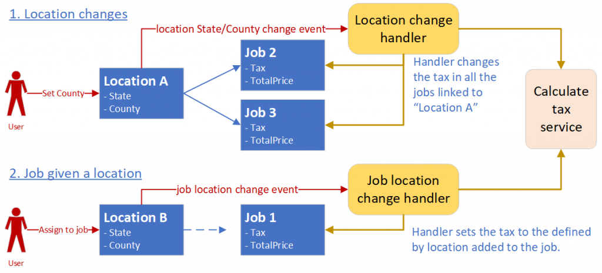
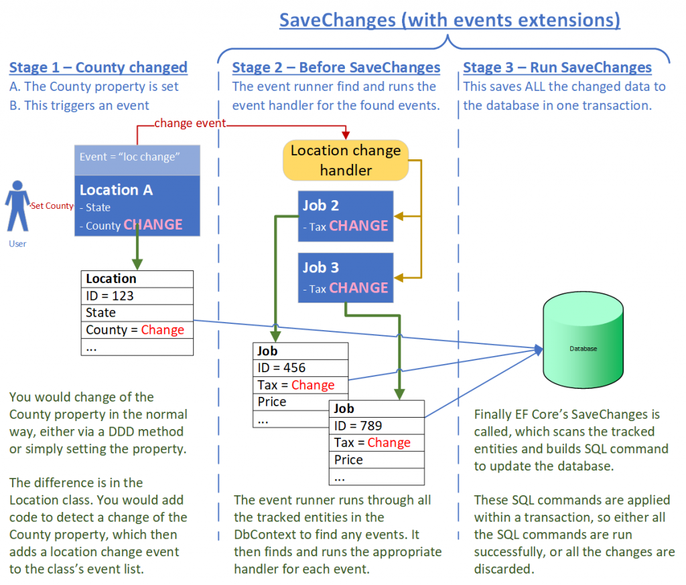

A robust event-driven architecture
==================================

The term “*event-driven architecture*” covers a wide range of distributed systems like MicroServices, Serverless etc. 
And `this chapter`_ from the book Software Architecture Patterns says event-driven architectures have many useful features, 
but they are hard to build and test. One reason for that is because designing a system that is robust, i.e. works in all 
situations, requires significant thought and code.

.. _`this chapter`: https://www.oreilly.com/library/view/software-architecture-patterns/9781491971437/ch02.html

I came across a simple, but useful application of events to trigger code that accesses the database via EF Core. While 
this is a very small subset of the whole event-driven space I think it is very useful, especially as it is inherently 
robust. In fact, I like the approach so much I have built a library called OurPresence.Core.GenericEventRunner so I can 
easily add this feature to any projects I work on.

Summary
-------

* This is about a specific event-driven design that works with EF Core. It is limited in what it does -mainly 
  database updates, but it does that in a robust way.
* The advantages for this design are:
   * Using is event-driven design helps you to apply Separation of Concerns in your application.
   * The design is robust by design. It saves the original data that caused the events with the data updated by the event handler together in one transaction.
   * The event-driven design helps apply a Domain-Driven Design to your code.
* The disadvantages for this design are:
  * More difficult to follow the application flow
  * Adds some complexity to your application.
* The rest of the article gives examples of how the event-driven design works with EF Core.

Why is this event system useful?
^^^^^^^^^^^^^^^^^^^^^^^^^^^^^^^^

I came across an event-driven design from a `Jimmy Bogard article`_, let me explain what I liked and disliked about this approach.

.. _`Jimmy Bogard article`: https://lostechies.com/jimmybogard/2014/05/13/a-better-domain-events-pattern/

First benefit: Separation of concerns
~~~~~~~~~~~~~~~~~~~~~~~~~~~~~~~~~~~~~

When you set, or change, the location you have to recalculate the tax for this job, or any job linked to that 
location. But for me changing the location’s address is a very different to a recalculation of the job’s tax.

From a design point of view changing the location, which can be done by a simple update to the State and Country properties, 
doesn’t naturally fit with recalculating the tax on an invoice. And the same location might be used in multiple invoices, 
which makes the simple setting of State and Country into a much more complex piece of business logic.

The solution is to kick off a “location State Country” event any time a location’s State Country properties change, or a 
“*job location change*” event if a different location is selected for a job. It is then down to the event handlers for these 
two events to recalculate the tax for that job, or jobs. See the two different use cases below, with the events in red, 
the event handler in orange, and classes mapped to the database in blue.

So, in effect we have separated the “change location” logic from the “calculation of the tax” logic. That might seem 
small, but to me with my design hat on that is very good “*separation of concerns*”. And with my developer 
hat on it makes the setting of the location really simple, leaving the complex tax calculation to be run separately.

An application can have loads of these linked business rules which benefit from using events like this.

Second benefit: Its robust by design
~~~~~~~~~~~~~~~~~~~~~~~~~~~~~~~~~~~~

It is really easy to design applications when everything is normal and there are no competing updates. But designing systems 
that can handles error situations, concurrency issues, and database connection faults is way harder. For that reason, I’m 
always looking for designs that handle these errors by design, and this event approach does that for everything but some 
concurrency issues.

As you will see later, the data that triggered an event, as in the last example, the location, and any data 
that changed like the TaxRate, are saved together in one transaction by calling to EF Core’s SaveChanges method. 
That is important because either all the data is saved, or no data is saved. That means the original data and the 
data from the events will never get out of step.

And if you do have an exception on SaveChanges, such as a ``DbUpdateConcurrencyException``, all the data is now in the DbContext 
and the events have been cleared. This means you can “*fix*” the problem and safely call `SaveChanges` again and it will save the 
original data and event-generated data to the database, with no extra event calls.

Third benefit: This event-driven design fits with Domain-Driven Design
~~~~~~~~~~~~~~~~~~~~~~~~~~~~~~~~~~~~~~~~~~~~~~~~~~~~~~~~~~~~~~~~~~~~~~

**Domain-Driven Design** or DDD is, to quote the http://dddcommunity.org site, “*is an approach to developing software 
for complex needs by deeply connecting the implementation to an evolving model of the core business concepts.*”. 
I for one try to use a DDD approach in anything I do.

Some DDD users advocate that the code inside the entity class should not know anything about the database, I’m not in that 
camp, but I respect their views. That means you need to do all the database work before you go to the entity class. But 
the event-driven design I am describing gives you another option – you can send an event to a handler that can access the 
database for the class.

Taking the example of the location effecting the tax, then using an event-driven approach allows the class to ask an external 
service to calculate the tax, which in this case needs to access the database. I think that keeps the separation of database 
from the entity class, while handling the business rule in an efficient and fast way.

Downsides of using the event-driven design.
^^^^^^^^^^^^^^^^^^^^^^^^^^^^^^^^^^^^^^^^^^^

It’s important to think about the downside of this event-driven design as well, as no extra feature comes without a price.

First downside: Using events can make it difficult to follow the code
~~~~~~~~~~~~~~~~~~~~~~~~~~~~~~~~~~~~~~~~~~~~~~~~~~~~~~~~~~~~~~~~~~~~~

The first problem is described by Martin Fowler in an excellent article called `What do you mean by “Event-Driven”`_?. He 
says “*The problem is that it can be hard to see such a flow as it’s not explicit in any program text.*”

.. _`What do you mean by “Event-Driven”`: https://martinfowler.com/articles/201701-event-driven.html

For instance, there is an example above where the two types of events “*location State Country*” and “*job location change*”), 
but what do those events call? You can’t use the VS/VSCode ``Go to Definition`` **F12** feature to go to the handler code because 
its hidden behind layers of interfaces and DI. That can make things hard to follow.

My advice is, if you have business code where all the business rules sensibly belongs together then write one set of code, 
and don’t use events. Only use events where it makes sense, like decoupling the setting of the location from the recalculation 
of the tax rate. I also suggest you name of the event and the handler to start with the same name, e.g. ``LocationChangeEvent`` and 
``LocationChangeHandler`` respectively. That makes it easier to work out what code is called.

Second downside: Makes your application more complicated
~~~~~~~~~~~~~~~~~~~~~~~~~~~~~~~~~~~~~~~~~~~~~~~~~~~~~~~~

Adding event handling to an application isn’t simple and it changes your DbContext, especially around the SaveChanges/SaveChangesAsync. 
Complexity is bad, as it makes the application harder to understand and test. You have to weigh up the usefulness of the event-driven 
design against the extra complexity it adds to your application.

Implementing this in EF Core
----------------------------

Details
^^^^^^^

I have described the pros and cons of the approach, so now we look at how it works. I start with a diagram which shows 
the three stages of the event handling.

This example gives a good idea of what is possible and the next three sections show the code you need at each stage.  

Stage 1 – adding event triggers to your entity classes
~~~~~~~~~~~~~~~~~~~~~~~~~~~~~~~~~~~~~~~~~~~~~~~~~~~~~~

An event is triggered in an entity class that you have read in and is tracked, i.e. it wasn’t loaded with a query that has 
the ``.AsNoTracking`` in it. This is because the event runner only looks for events in tracked entities.

You can send an event from anywhere, but the typical approach is to trigger an event when something changes. One way is 
to catch the setting of a property by using a backing field and testing if something changes in the property setter. 
Here is an example:

.. code-block:: csharp

    private string _country;
    public decimal Country
    {
        get => _country;
        private set
        {
            if (value != _country)
                AddEvent(new LocationChangeEvent(value));
            _country = value;
        }
    }

The things to note are:

* Line 1: I’m using a private field so that I can add my own code in the property setter. Converting a normal property 
  to this form is handled by EF Core via a backing field and the name of the column in the table is unchanged. 

.. NOTE: In EF Core 3 and above when EF Core loads data it puts it in the private field, not via the setter – that’s 
   good otherwise the load could cause an event (before EF Core 3 the default was to set via the property, which 
   would have generated an event).

* Lines 7 & 8: This is code that triggers an event if the Tax value has changed.

If you are using a Domain-Driven Design (DDD) then you can put the AddEvent call in your DDD method or constructors. 
Here is an example from the example code in the EfCore.GenericEventRunner code.

.. code-block:: csharp

    public Order(string userId, DateTime expectedDispatchDate, ICollection<BasketItemDto> orderLines)
    {
        UserId = userId;
        DispatchDate = expectedDispatchDate;
        AddEvent(new OrderCreatedEvent(expectedDispatchDate, SetTaxRatePercent));
    
        var lineNum = 1;
        _LineItems = new HashSet<LineItem>(orderLines
            .Select(x => new LineItem(lineNum++, x.ProductName, x.ProductPrice, x.NumOrdered)));
    
        TotalPriceNoTax = 0;
        foreach (var basketItem in orderLines)
        {
            TotalPriceNoTax += basketItem.ProductPrice * basketItem.NumOrdered;
            AddEvent(new AllocateProductEvent(basketItem.ProductName, basketItem.NumOrdered));
        }
    }
    private void SetTaxRatePercent(decimal newValue)
    {
        TaxRatePercent = newValue;
    }

The things to note are:

* Line 5: The event add here is given a method called SetTaxRatePercent (see lines 18 to 21) which allows 
  the event to set the TaxRatePercent property which has a private setter. I do this because I using a DDD 
  design where all the properties are read-only, but I hand the event handler, via the event a method to 
  set that property.

* Line 15. I want to allocate each item of stock from this order and to do this I must send over the 
  information in the event. That’s because the Order isn’t in the database yet, so the event handler 
  can’t read the database to get it.

.. NOTE: If you trigger an event in a constructor make sure its not the constructor that EF Core will use 
   when loading the data – check the EF Core documentation on how this works.

Stage 2 – Before SaveChanges
~~~~~~~~~~~~~~~~~~~~~~~~~~~~

The OurPresence.Core.GenericEventRunner overrides the base SaveChanges/SaveChangesAsync and has an event 
runner that will find all the events before SaveChanges/SaveChangesAsync is called. It does this by looking 
for all the tracked entities (i.e. any classes loaded, Added, Attached etc.) that has inherited  
OurPresence.Core.GenericEventRunner’s EntityEvents class. This contains methods to get the events 
and then wipes the events (I do that to ensure an event isn’t run twice).

.. NOTE: To make it simpler to understand I talked about “events”, but in fact there are two types of events 
   in OurPresence.Core.GenericEventRunner: the BeforeSave and the AfterSave events, which run before or after 
   the call to SaveChanges/SaveChangesAsync respectively. I will explain why I added the AfterSave events

(Before) Handlers have to inherit the following interface, where the T part is the type of event the handler can process.

.. code-block:: csharp

    public interface IBeforeSaveEventHandler<in T> where T : IDomainEvent
    {
        IStatusGeneric Handle(EntityEvents callingEntity, T domainEvent);
    }

Here is an example handler for working out the Tax value

.. code-block:: csharp

    public class OrderCreatedHandler : IBeforeSaveEventHandler<OrderCreatedEvent>
    {
        private readonly TaxRateLookup _rateFinder;
    
        public OrderCreatedHandler(ExampleDbContext context)
        {
            _rateFinder = new TaxRateLookup(context);
        }
    
        public IStatusGeneric Handle(EntityEvents callingEntity, 
            OrderCreatedEvent domainEvent)
        {
            var tax = _rateFinder.GetTaxRateInEffect(domainEvent.ExpectedDispatchDate);
            domainEvent.SetTaxRatePercent(tax);
    
            return null;
        } 
    }

The OurPresence.Core.GenericEventRunner library has an extension method called RegisterGenericEventRunner which scans 
the assemblies you provide to find all the handlers that have the IBeforeSaveEventHandler (and IAfterSaveEventHandler) 
interfaces. You should put this in your start-up code where the other dependency injection (DI) items are registered.

In the overridden SaveChanges/SaveChangesAsync methods an event runner looks for event handlers in the DI services 
that match the full handler + event type. It then runs each event handler with the event data.

.. NOTE: I am not covering the inner workings of the event handler here as I want to give you a good overview of the 
   approach.  Suffice to say there is a lot going on in the event handler.

Stage 3 – Run SaveChanges
~~~~~~~~~~~~~~~~~~~~~~~~~

The final stage is saving the data to the database. Its simple to do because EF Core does all the complex stuff. SaveChanges 
will inspect all the tracked entities and work out what State each entity is in: either Added, Modified, Deleted, or Unchanged. 
It then builds the database commands to update the database.

As I said earlier the important thing is the original data and the new data added by the event handlers are saved together 
in one transaction. That means you can be sure all the data was written out, or if there was a problem the nothing is left out.

Conclusions
^^^^^^^^^^^

I have described an event-driven design which is very limited in its scope: it focuses on updating database data via EF Core. 
This approach isn’t a “silver bullet” that does everything, but I think it is a valuable tool in building applications. I expect 
to still be using my normal business rule (see this article on how a build my business logic), but this event-driven design now 
allows me to access external services (i.e. event handlers) while inside the entity class, which is something I have wanted to 
be able to do for a while.

I spent some time describing the design and its benefits because it wasn’t obvious to me how useful this event-driven design was 
until I saw the client’s system. Also, I felt it was best to describe how it works before describing the 
OurPresence.Core.GenericEventRunner library, which I do in the next article.

I want to recognise Jimmy Bogard Blog for his original article on an event-driven approach that my client used. I find Jimmy’s 
articles really good as he, like me, writes from his work with clients. I also want to thank my client for exposing me to this 
approach in a real-world system.

An event-driven library that works with EF Core
===============================================

Library Summary
---------------

* This section describes how to use the OurPresence.Core.GenericEventRunner library.
* OurPresence.Core.GenericEventRunner adds a specific event-driven system to EF Core.
* I break up the description into five sections
  * Code to allow your EF Core classes to send events
  * How to build event handlers
  * How the events are run when SaveChanges/SaveChangesAsync is called.
  * How to register your event handlers and GenericEventRunner itself.
  * How to unit test an application which uses GenericEventRunner.

1. Supports async event handlers
^^^^^^^^^^^^^^^^^^^^^^^^^^^^^^^^

You can now define async Before/After event handlers. These only work when you call SaveChangesAsync.

.. NOTE: If you want to have a sync and async version of the same event handler, then you can if you follow a 
   simple naming rule – give your two event handler the same name, but the async one has “Async” on the end 
   . GenericEventRunner will run the async if SaveChangesAsync is called and won’t run the sync version.

2. Now supports clean code architecture
^^^^^^^^^^^^^^^^^^^^^^^^^^^^^^^^^^^^^^^

There is a very small (one class, one enum, and one interface) library called OurPresence.Core.GenericEventRunner.DomainParts 
that you use in the domain project. This contains the class you need to inherit in an entity class to create events.

Overview of OurPresence.Core.GenericEventRunner library
^^^^^^^^^^^^^^^^^^^^^^^^^^^^^^^^^^^^^^^^^^^^^^^^^^^^^^^

I’m going to go though the four parts of the OurPresence.Core.GenericEventRunner library (plus something on unit testing) to 
demonstrate how to use this library. I start with a diagram which will give you an idea of how you might use GenericEventRunner. 
Then I will dive into the four parts.

In the diagram the blue rectangles are classes mapped to the database, with the events shown in light color at the bottom. The 
orange rounded rectangle is an event handler.

.. image: ../_static/GenericEventRunnerExampleAllocate-1024x763.png

Here are the four parts of the library, plus a section on unit testing:

1. ForEntities: This has the code that allows a class to contain and create events.
#. ForHandlers: This contains the interfaces for building handlers.
#. ForDbContext: The DbContextWithEvents<T> which contains the overriding of the SaveChanges/ SaveChangesAsync.
#. The code for registering your event handlers and GenericEventRunner’s EventsRunner.
#. How to unit test an application which uses GenericEventRunner (and logging).

.. NOTE: The code in is article taken from the code in the OurPresence.Core.GenericEventRunner repo used to test the 
     library. I suggest you look at that code and the unit tests to see how it works.

1. ForEntities: code for your entity classes (see DataLayer in GenericEventRunner repo)
~~~~~~~~~~~~~~~~~~~~~~~~~~~~~~~~~~~~~~~~~~~~~~~~~~~~~~~~~~~~~~~~~~~~~~~~~~~~~~~~~~~~~~~

For this example, I am going to show you how I built the “1. Create new Order” (LHS of last diagram). The purpose of 
this event is to query the stock part a) is there enough stock to manage this order, and b) allocate some stock ready 
for this order.

The first thing I needed is an “allocate” event. An event is class that inherits the IDomainEvent interface. Here 
is my “allocate” event.

.. code-block:: csharp

    public class AllocateProductEvent : IDomainEvent
    {
        public AllocateProductEvent(string productName, int numOrdered)
        {
            ProductName = productName;
            NumOrdered = numOrdered;
        }
    
        public string ProductName { get; }
        public int NumOrdered { get; }
    }

In this case this event is sent from a new order which hasn’t been saved to the database. Therefore, I have to send the 
ProductName (which in my system is a unique key) and the number ordered because its not (yet) in the main database. 
Even if the data is in the database, I recommend sending the data in the event, as a) it saves a database access 
and b) it reduces the likelihood of concurrency issues (I’ll talk more on concurrency issues in the next article).

The next thing is to add that event to the Order class. To be able to do that the Order class must inherit abstract 
class called EntityEvents, e.g.

.. code-block:: csharp

    public class Order : EntityEvents
    { 
        //… rest of class left out

The EntityEvents class provides an AddEvent method which allows you to add a new event to your entity. It also 
stores the events for the Event Runner to look at when SaveChanges is called. (note that the events aren’t saved 
to the database – they only hang around as long as the class exists).

Below is the Order constructor, with the focus on the AllocateProductEvent – see the highlighted lines 10 and 11

.. code-block:: csharp

    public Order(string userId, DateTime expectedDispatchDate,
        ICollection<BasketItemDto> orderLines)
    {
        //… some other code removed
    
        TotalPriceNoTax = 0;
        foreach (var basketItem in orderLines)
        {
            TotalPriceNoTax += basketItem.ProductPrice * basketItem.NumOrdered;
            AddEvent(new AllocateProductEvent(
                basketItem.ProductName, basketItem.NumOrdered));
        }
    }

If you don’t use DDD, then the typical way to create an event is to catch the setting of a property. Here is an 
example of doing that taken from the first article.

.. code-block:: csharp

    private string _country;
    public decimal Country
    {
        get => _country;
        private set
        {
            if (value != _country)
                AddEvent(new LocationChangeEvent(value));
            _country = value;
        }
    }

This works because the property Country is changed into an EF Core backing field, and the name of the column in the table 
is unchanged. But because it’s now a backing field EF Core 3 will (by default) will read/write the field, not the property, 
which is good otherwise the load could cause an event.

.. NOTE: EF Core 3 default action is to read/write the field, but before EF Core 3 the default was to set via the property, 
   which would have generated an event.

Types of events
^^^^^^^^^^^^^^^

When it comes to adding an event there are two separate lists: one for BeforeSave events and one for AfterSave events. The 
names give you a clue to when the handler is run: the BeforeSave events run before SaveChanges is called, and AfterSave 
events are run after SaveChanges is called.

I cover the two types of events in the next section, but I can say that BeforeSave events are by far the most used type, 
so that is the default for the AddEvent method. If you want to send an event to be run after SaveChanges, then you need 
to add a second parameter with the type, e.g. AddEvent(…, EventToSend.AfterSave).

2. ForHandlers: Building the event handlers
~~~~~~~~~~~~~~~~~~~~~~~~~~~~~~~~~~~~~~~~~~~

You need to create the event handlers to handle the events that the entity classes sent out. There are two types of event 
handler IBeforeSaveEventHandler<TEvent> and IAfterSaveEventHandler<TEvent>. Let me explain why I have the two types.

BeforeSave events and handlers
++++++++++++++++++++++++++++++

The BeforeSave events and handlers are all about the database. The idea is the BeforeSave handlers can change the entity 
classes in the database, and those changes are saved with the original data that your normal (non-event trigger) code set 
up. As I explained in the first article saving the original data and any data changed by the event together in one transaction 
is safe, as the data can’t get out of step.

Typically, a BeforeSave event will be triggered when something changes, or an event happens. The handler then either does 
some calculation, maybe accessing the database and returns a result to be saved in the calling entity and/or it might create, 
update or remove (delete) some other entity classes. The data changes applied by the normal code and the data changes applied 
by the event handler are saved together.

BeforeSave event handlers also have two extra features:

1. Firstly, they can return an (optional) IStatusGeneric status, which can send back errors. If it returns null or a status 
   with no errors then the SaveChanges will be called.

Here is an example of a BeforeSave event handler which was called by the AllocateProductEvent you saw before. This checks 
that there is enough stock to accept this order. If it returns a status with any errors, then that stops 
SaveChanges/SaveChangesAsync from being called.

.. code-block:: csharp

    public class AllocateProductHandler : IBeforeSaveEventHandler<AllocateProductEvent>
    {
        private readonly ExampleDbContext _context;
    
        public AllocateProductHandler(ExampleDbContext context)
        {
            _context = context;
        }
    
        public IStatusGeneric Handle(EntityEvents callingEntity,
            AllocateProductEvent domainEvent)
        {
            var status = new StatusGenericHandler();
            var stock = _context.Find<ProductStock>(domainEvent.ProductName);
            //… test to check it was found OK removed 
    
            if (stock.NumInStock < domainEvent.NumOrdered)
                return status.AddError(
                    $"I could not accept this order because there wasn't enough {domainEvent.ProductName} in stock.");
    
            stock.NumAllocated += domainEvent.NumOrdered;
            return status;
        }
    }

The lines of code to highlight are:

* Lines 18 to 19. If there isn’t enough stock it adds an error to the status and returns it immediately. This will 
  stop the SaveChanges from being called.
  The default situation is the first BeforeSave event handler that returns an error will stop immediately. If you 
  want all the BeforeSave events to continue, say to get all the possible error messages, then you can set the 
  StopOnFirstBeforeHandlerThatHasAnError property to false in the GenericEventRunnerConfig class provided at 
  setup time (see 4. ForSetup: Registering service on config).

  If the returned status has errors, then all the events are cleared and SaveChanges/Async isn’t called 
  (see section “3. ForDbContext” for how these errors are returned to the application).

.. NOTE: Only a few of your BeforeSave handlers will need a status so you can return null as a quick way to say 
   there are no errors (or more precisely the handler is not looking for errors). You can return a status with 
   no errors and update the statues’ success Message string which will mean that Message will be returned at the 
   top level (assuming a later BeforeSave handler doesn’t overwrite it).

2. Secondly, BeforeSave handlers can raise more events directly or indirectly. For instance, say an event handler 
   changed a property that raised another event we need to pick that new event too. For that reason, the BeforeSave 
   handler runner keeps looping around checking for new events until there are no more.

.. NOTE: There is a property in the GenericEventRunnerConfig class called MaxTimesToLookForBeforeEvents value to stop 
   circular events, e.g. an event calls something that calls the same event, which would loop for ever. If the BeforeSave
   handler runner loops around more than the MaxTimesToLookForBeforeEvents value (default 6) it throws an exception. See 
   section “4. For setup” on how to change the GenericEventRunner’s configuration.

AfterSave events and handlers
^^^^^^^^^^^^^^^^^^^^^^^^^^^^^

AfterSave events are there to do things once the SaveChanges is successful and you know the data is OK. Typical uses are clearing 
a cache because certain data has changed, or maybe use SignalR to update a screen with the changed data. Unlike the BeforeSave events 
the events runner only looks once at all the events in the entity classes, so AfterSave events handlers can’t trigger new events.

Here is an example of an AfterSaveEventHandler that would send an internal message to the dispatch department once an Order 
is successfully placed in the database.

.. code-block:: csharp

    public class OrderReadyToDispatchAfterHandler : 
        IAfterSaveEventHandler<OrderReadyToDispatchEvent>
    {
        public void Handle(EntityEvents callingEntity,
            OrderReadyToDispatchEvent domainEvent)
        {
            //Send message to dispatch that order has been checked and is ready to go
        }
    }

AfterSave event handers aren’t “safe” like the BeforeSave events in that if they fail the database update is already done and 
can’t be undone. Therefore, you want to make your AfterSave event handlers aren’t going to cause exceptions. They also shouldn’t 
update the database (that’s the job of the BeforeSave event handlers).

AfterSave event handers also don’t return any status so you can’t know if they worked on not (see one way around this in 
section “4. Setup” on how to check an AfterSave event handler ran).

3. ForDbContext: Overriding of EF Core’s base SaveChanges/SaveChangesAsync
^^^^^^^^^^^^^^^^^^^^^^^^^^^^^^^^^^^^^^^^^^^^^^^^^^^^^^^^^^^^^^^^^^^^^^^^^^

To make this all work GenericEventRunner needs to override the base SaveChanges/ SaveChangesAsync methods. GenericEventRunner 
library provides a class called DbContextWithEvents<T>, which contains overrides for the SaveChanges/ SaveChangesAsync and two 
extra versions called SaveChangesWithStatus/ SaveChangesWithStatusAsync that return a status. Here is a my ExampleDbContext that 
I use for unit testing GenericEventRunner.

.. code-block:: csharp

    public class ExampleDbContext
        : DbContextWithEvents<ExampleDbContext>
    {
        public DbSet<Order> Orders { get; set; }
        public DbSet<LineItem> LineItems { get; set; }
        public DbSet<ProductStock> ProductStocks { get; set; }
        public DbSet<TaxRate> TaxRates { get; set; }
    
        public ExampleDbContext(DbContextOptions<ExampleDbContext> options, 
            IEventsRunner eventRunner = null)
            : base(options, eventRunner)
        {
        }
    
        protected override void OnModelCreating(ModelBuilder modelBuilder)
        {
            modelBuilder.Entity<ProductStock>().HasKey(x => x.ProductName);
        }
    }

* Line 2 is the only change in your DbContext. Instead of inheriting DbContext, you inherit GenericEventRunner’s 
  DbContextWithEvents<T>, where T is your class. This overrides the SaveChanges/ SaveChangesAsync and adds some 
  other methods and the IStatusGeneric<int> StatusFromLastSaveChanges property.

For people who are already overriding SaveChanges you can either still layer DbContextWithEvents<T> class on top 
of your SaveChanges method, which GenericEventRunner will override, and call at the appropriate time. If you want 
to customise your DbContext then the methods used in the DbContextWithEvents<T> class are public, so you can use 
them directly. This allows you to reconfigure the GenericEventRunner SaveChanges/ SaveChangesAsync to suit your system.

What happens if BeforeSave event handler send back an error?
~~~~~~~~~~~~~~~~~~~~~~~~~~~~~~~~~~~~~~~~~~~~~~~~~~~~~~~~~~~~

As I said earlier if the BeforeSave event handlers return an error it does not call SaveChanges/Async, but you most 
likely want to get the error messaged, which are designed to be shown to the user. I expect most developers to call 
SaveChanges/Async so the GenericEventRunner throws a GenericEventRunnerStatusException if the combined statuses of 
all the BeforeSave handlers has any errors. You can then get the errors in two ways:

The Message property of the GenericEventRunnerStatusException contains a string starting with an overall message 
and then each error (separated by the Environment.NewLine characters). This returns just the error text, not the 
full ValidationResult.
For a more detailed error response you can access the IStatusGeneric<int> StatusFromLastSaveChanges property in the 
DbContext. This provides you with access to the Errors list, where each error has an ErrorResult of type ValidationResult, 
where you can specify the exact property that caused a problem.

.. NOTE: The IStatusGeneric<int> StatusFromLastSaveChanges property will be null if SaveChanges hasn’t yet been called.

The alternative is to call the SaveChangesWithStatus/ SaveChangesWithStatusAsync methods directly. That way you can 
get the status directly without having to use a try/catch. This makes getting the status easier, but if you have a 
lot of existing code that already calls SaveChanges/SaveChangesAsync then its most likely best to stay with SaveChanges/Async 
and capture the exception where you need to.

What is the state of the current DbContext when there are exceptions?
~~~~~~~~~~~~~~~~~~~~~~~~~~~~~~~~~~~~~~~~~~~~~~~~~~~~~~~~~~~~~~~~~~~~~

We need to consider what state the DbContext is in when there are exceptions. Here is the list:

Exceptions before SaveChanges is called (other than GenericEventRunnerStatusException): In this state there may be changes 
in the database and any events are still there. Therefore, you need to be very careful if you want to call SaveChanges 
again (Note: this isn’t much different from what happens if you don’t have events – you don’t really know what state the 
DbContext is in after an exception and you should not try to call SaveChanges).
Exceptions during SaveChanges, e.g. DbUpdateConcurrencyException. If you get an exception during SaveChanges itself then 
it’s something about the database. The DbContext will have all the data ready to retry the SaveChanges, if you can “fix” 
the problem. If you call SaveChanges again (after fixing it) and it succeeds then all the BeforeEvents have been cleared 
(because they have already been applied to the DbContext), but any AfterSave events are still there and will run.
Exceptions after SaveChanges was called. The database is up to date. If an AfterSave event handler throws an exception then 
other AfterSave event handlers may be lost. As I said AfterSave event handlers are not robust.

4. ForSetup: Registering your event handlers
^^^^^^^^^^^^^^^^^^^^^^^^^^^^^^^^^^^^^^^^^^^^

The final stage is to register all your event handlers, and the EventsRunner from the GenericEventRunner library. This is
done using the extension method called RegisterGenericEventRunner. There are two signatures for this method. Both need 
an array of assemblies that is needs to scan to find your BeforeSave/AfterSave event handlers, but one starts with property 
of type IGenericEventRunnerConfig by which you can change the GenericEventRunner default configuration. Here is an example 
in ASP.NET Core without a config.

.. code-block:: csharp

    public void ConfigureServices(IServiceCollection services)
    {
        //… other service registeration left out
        services.RegisterGenericEventRunner(
                    Assembly.GetAssembly(typeof(OneOfMyEventHandlers)));
    }

NOTES:

* You can provide multiple assemblies to scan.
* If you don’t provide any assemblies it will scan the calling assembly.
* If its scan doesn’t find any AfterSave event handlers then it sets the NotUsingAfterSaveHandlers config property to false 
  (saves time in the the SaveChanges/ SaveChangesAsync).

.. NOTE: If you send an event has hasn’t got a registered handler then you will get a GenericEventRunnerException at run time.

There are two ways to configure GenericEventRunner and the event handlers at startup.

You can provide a GenericEventRunnerConfig class at the first parameter to the RegisterGenericEventRunner. You can change 
the default setting of various parts of GenericEventRunner (see the config class for what features it controls).

There is an EventHandlerConfig Attribute which you can add to an event handler class. From this you can set the lifetime of 
the handler. The default is transient

.. NOTE: The ability to change the lifetime of an event handler is there in case you need to communicate to event handler in 
   some way, e.g. to check that an AfterSave event handler has run properly. In this case you could set the event handler’s 
   lifetime to “Scoped” and use DI to inject the same handler into your code. (This is advanced stuff! – be careful).

5. Unit Testing applications which use GenericEventRunner
^^^^^^^^^^^^^^^^^^^^^^^^^^^^^^^^^^^^^^^^^^^^^^^^^^^^^^^^^

I recommend unit testing your events system, as if you haven’t provided an event handler you will get a runtime exception. 
Setting up the system to test events is a little complex because GenericEventRunner uses dependency injection (DI). I have 
therefore built some code you might find useful in unit tests.

The class called SetupToTestEvents in the GenericEventRunner’s Test assembly that contains an extension method called 
CreateDbWithDiForHandlers that registers your event handlers and return an instance of your DbContext, with the required 
EventsRunner, to use in your unit tests. Here is an example of how you would use it in a unit test.

.. code-block:: csharp

    [Fact]
    public void TestOrderCreatedHandler()
    {
        //SETUP
        var options = SqliteInMemory.CreateOptions<ExampleDbContext>();
        var context = options.CreateDbWithDiForHandlers 
            <OrderCreatedHandler>();
        {
            context.Database.EnsureCreated();
            context.SeedWithTestData();
    
            var itemDto = new BasketItemDto
            {
                ProductName = context.ProductStocks.OrderBy(x => x.NumInStock).First().ProductName,
                NumOrdered = 2,
                ProductPrice = 123
            };
    
            //ATTEMPT
            var order = new Order("test", DateTime.Now, new List<BasketItemDto> { itemDto });
            context.Add(order);
            context.SaveChanges();
    
            //VERIFY
            order.TotalPriceNoTax.ShouldEqual(2 * 123);
            order.TaxRatePercent.ShouldEqual(4);
            order.GrandTotalPrice.ShouldEqual(order.TotalPriceNoTax * (1 + order.TaxRatePercent / 100));
            context.ProductStocks.OrderBy(x => x.NumInStock).First().NumAllocated.ShouldEqual(2);
        }
    } 

The lines of code to highlight are:

* Line 5: You create your database options. In this case I am using a method in my EfCore.TestSupport library to create an 
  in-memory Sqlite database, but it could be any type of database.
* Line 6 and 7: This is where I call the CreateDbWithDiForHandlers extension method which needs two types:
  * TContext: This is your DbContext class
  * THandler: This should be one of your event handlers. This is used for find an assembly which GenericEventRunner 
    needs to scan to find all your event handlers are in so that it can register them in DI. (It also registers any event 
    handlers in the executing assembly – that allows you to add extra handlers for unit testing).

The CreateDbWithDiForHandlers extension method has some useful optional parameters- have a look at the code to see what they provide.

.. NOTE: I didn’t include the SetupToTestEvents class in the OurPresence.Core.GenericEventHandler because it uses code from my 
   OurPresence.Core.TestSupport library. You will need to copy it by hand from the GitHub repo into your unit test assembly.

Logging
-------

The GenericEventRunner Event Runner logs each event handler before it is run. The log message starts with a prefix:

* First letter: ‘A’ for AfterSave event handlers and ‘B’ for BeforeSave event handlers
* Then number: this show what loop was it run, e.g. 1, 2, 3 etc. (remember, BeforeHandlers can create new events, which 
  needs another loop around to find them). This is generally useful to see what events are fired when.

Here is an example from one of m GenericEventRunner unit tests. Notice that the last log message starts with “B2”, which 
means it must have been triggered by a change caused by one of the event handlers that run in the first (i.e. “B1”) event loop.

"B1: About to run a BeforeSave event handler …OrderCreatedHandler."
"B1: About to run a BeforeSave event handler …AllocateProductHandler."
"B2: About to run a BeforeSave event handler …TaxRateChangedHandler."

Also, the unit test CreateDbWithDiForHandlers method allows you to capture logs, which can be useful in testing that events 
handlers run at the correct time.
