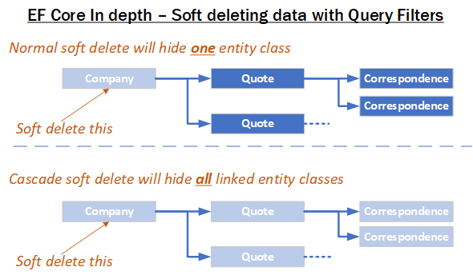
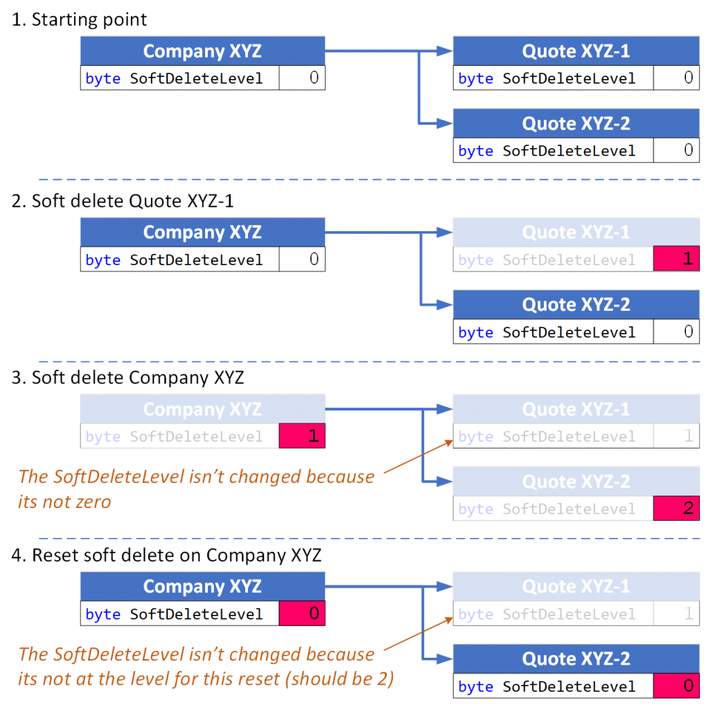

SoftDeleteServices
==================

This contains code to handle soft delete in a generic way. The code handles all the setting, resetting and finding of soft deleted entities. 
This code also incorporates other Query filters, such as multi-tenant keys, to make sure you only soft delete/reset entities that 
you have access to.

There are two services:

* **Single soft delete**: where a single entity class can be hidden from normal queries and restore back if required.
* **Cascade soft delete**: where when an entity is soft deleted, then its dependent entity classes are also soft deleted. 
  The cascade soft delete is pretty clever, and can handle multi-level soft deletes 

General information on how the simple and cascade methods work
--------------------------------------------------------------

There four basic things your can do with both the single and cascade libraries 

1. Set the entity's soft deleted property to hidden, i.e. the entity won't be seen a normal query. 
#. Reset the entity's soft delete property to not soft deleted, i.e. the entity is  seen in a normal query.
#. Hard delete any entity(s) that have are already soft deleted (useful protection against hard delete being applied by accident).
#. Find all the soft deleted items that are soft deleted and can be reset - useful for showing a user the soft deleted 

I lot of things are configurable in the `SoftDeleteConfiguration` class. Its designed to work with your own data layer 
and interfaces. See the `OurPresence.Core.SoftDelete.Tests` project for examples of how to use it. 

Terms
-----

* **Hard delete** is when you delete a row in the database, via the EF Core `Remove` method. A hard delete removes the row from 
  the database and may effect other entities/rows.
* **Single soft delete** mimics a one row, hard delete. The entity/row is still in the database, but won't show up in EF Core 
  query. But you can un-soft delete, referred to as a soft delete **reset**, and the makes the entity visible in an EF Core query.
* **Cascade soft delete** mimics the hard delete cascade approach and will soft delete any dependant relationships (the  
  EF Core `DeleteBehavior` has an effect on what happens).
* **Soft delete** covers both Single soft delete and Cascade soft delete

Soft deleting data with Global Query Filters
============================================

Summary
-------

* You can add a soft delete feature to your EF Core application using Global Query Filters (referred to as Query Filters from now on).
* The main benefits of using soft delete in your application are inadvertent deletes can be restored and history is preserved.
* There are three parts to adding the soft delete feature to your application
  * Add a new soft delete property to every entity class you want to soft delete.
  * Configure the Query Filters in your application’s DbContext
  * You create code to set and reset the soft delete property.
* You can combine soft delete with other uses of Query Filters, like multi-tenant uses but you need to be more careful when you are looking for soft deleted entries.
* Don’t soft delete a one-to-one entity class as it can cause problems.
* For entity classes that has relationships you need to consider what should happen to the dependant relationships when the top entity class is soft deleted.
* I introduce a way to implement a cascade soft delete that works for entities where you need its dependant relationships soft deleted too.

Setting the scene – why soft delete is such a good idea
-------------------------------------------------------

When you hard delete (I use the term hard delete from now on, so its obvious what sort of delete I’m talking about), then it gone from your database. 
Also, hard deleting might also hard delete rows that rely on the row you just hard deleted (known as dependant relationships). 
And as the saying says “**When it’s gone, then it’s gone**” – no getting it back unless you have a backup.

But nowadays we are more used to “**I deleted it, but I can get it back**” – On windows it’s in the recycle bin, if you deleted some text in an
editor you can get it back with ctrl-Z, and so on. Soft delete is EF Core’s version of windows recycle bin – the entity class (the term for
classes mapped to the database via EF Core) is gone from normal usage, but you can get it back.

Any “*delete*” the normal user did set the soft delete flag, but an admin user could reset the soft delete flag to get the item back for the user. 
In fact, the terms “*delete*” for a soft delete and “*destroy*” for a hard delete. The other benefit of keeping soft-deleted data is history – you
can see what changed in the past even its soft deleted. Most client’s keeps soft deleted data in the database for some time and only backup/remove 
that data many months (years?) later.

You can implement the soft delete feature using EF Core Query Filters. Query Filters are also used for multi-tenant systems, where each tenant’s 
data can only be accessed by users who belong to the same tenant. This means EF Core Query Filters are designed to be very secure when it comes
to hiding things – in this case data that has been soft deleted.

I should also say there are some down sides of using soft delete. The main one is performance – an extra, hidden SQL ``WHERE`` clause is included in
every query of entity classes using soft delete.

There is also a difference between how soft delete handles dependant relationships when compared with hard delete. By default, if you soft delete 
an entity class then its dependant relationships are NOT soft deleted, whereas a hard delete of an entity class would normally delete the dependant 
relationships. This means if I soft delete a Book entity class then the Book’s Reviews will still be visible, which might be a problem in some cases. 
At the end of this article I show you how to handle that and talk about a prototype library that can do cascade soft deletes.

Adding soft delete to your EF Core application
==============================================

In this section I’m going to go through each for the steps to add soft delete to your application

1. Add soft delete property to your entity classes that need soft delete
#. Add code to your DbContext to apply a query filter to these entity classes
#. How to set/reset Soft Delete

In the next sections I describe these stages in detail. I assume a typical EF Core class with normal read/write properties, but you can adapt it to 
other entity class styles, like Domain-Driven Design (DDD) styled entity classes.

1. Adding soft delete property to your entity classes
-----------------------------------------------------

For the standard soft delete implementation, you need a boolean flag to control soft delete. For instance, here is a Book entity with a
SoftDeleted property highlighted.

.. code-block:: csharp

    public class Book : ISoftDelete                   
    {
        public int BookId { get; set; }
        public string Title { get; set; }
        //… other properties left out to focus on Soft delete
    
        public bool SoftDeleted { get; set; }
    }

You can tell by its name, SoftDeleted, that if it is true, then its soft deleted. This means when you create a new entity it is not soft deleted.

You other thing I added was an ISoftDelete interface to the Book class (line 1). This interface says the class must have a public SoftDeleted 
property which can be read and written to. This interface is going to make it much easier to configure the delete query filters in your DbContext.

2. Configuring the soft delete query filters in your DbContext
--------------------------------------------------------------

You must tell EF Core which entity classes needs a query filter and provide a query which will be true if you want it to be seen. You can do this 
manually using the following code in your DbContext – see highlighted line in the following listing.

.. code-block:: csharp

    public class EfCoreContext : DbContext
    {
        public EfCoreContext(DbContextOptions<EfCoreContext> option)                      
            : base(options)                                           
        {}
                            
        //Other code left out to focus on Soft delete
    
        protected override OnModelCreating(ModelBuilder modelBuilder) 
        {
            //Other configuration left out to focus on Soft delete
    
            **modelBuilder.Entity<Book>().HasQueryFilter(p => !p.SoftDeleted);**
        }
    }

That’s fine but let me show you a way to automate adding query filters. This uses

1. The `modelBuilder.Model.GetEntityTypes()` feature available in the OnModelCreating method
2. A little bit of generic magic to create the correct query filter

Here are two part:

1. Automating the configuring of the soft delete query filters
^^^^^^^^^^^^^^^^^^^^^^^^^^^^^^^^^^^^^^^^^^^^^^^^^^^^^^^^^^^^^^

The `OnModelCreating` method in your DbContext is where you can configure EF Core via what are known as Fluent API 
configuration commands – you saw that in the last listing. But there is also a way you can look at each entity class 
and decide if you want to configure it.

In the code below you can see the foreach loop that goes through each entity class in turn. You will see a test to 
see if the entity class implements the ISoftDelete interface and if it does it calls a extension method I created 
to configure a query filter with the correct soft delete filter.

.. code-block:: csharp

    protected override void OnModelCreating(ModelBuilder modelBuilder)
    {
        //other manual configurations left out       
    
        foreach (var entityType in modelBuilder.Model.GetEntityTypes())
        {
            //other automated configurations left out
            if (typeof(ISoftDelete).IsAssignableFrom(entityType.ClrType))
            {
                entityType.AddSoftDeleteQueryFilter();      
            }    
        }
    }

2. Creating the AddSoftDeleteQueryFilter extension method
^^^^^^^^^^^^^^^^^^^^^^^^^^^^^^^^^^^^^^^^^^^^^^^^^^^^^^^^^

There are many configurations you can apply directly to the type that the GetEntityTypes method returns but setting up 
the Query Filter needs a bit more work. That’s because LINQ query in the Query Filter needs the type of the entity class 
to create the correct LINQ expression. For this I created a small extension class that can dynamically create the correct 
LINQ expression to configure the Query Filter.

.. code-block:: csharp

    public static class SoftDeleteQueryExtension
    {
        public static void AddSoftDeleteQueryFilter(this IMutableEntityType entityData)
        {
            var methodToCall = typeof(SoftDeleteQueryExtension)
                .GetMethod(nameof(GetSoftDeleteFilter), BindingFlags.NonPublic | BindingFlags.Static)
                .MakeGenericMethod(entityData.ClrType);
            var filter = methodToCall.Invoke(null, new object[] { });
            entityData.SetQueryFilter((LambdaExpression)filter);
        }
    
        private static LambdaExpression GetSoftDeleteFilter<TEntity>()
            where TEntity : class, ISoftDelete
        {
            Expression<Func<TEntity, bool>> filter = x => !x.SoftDeleted;
            return filter;
        }
    }

I really like this because it a) saves me time, and b) can’t forget to configure a query filter.

3. How to set/reset Soft Delete
-------------------------------

Setting the SoftDeleted property to true is easy – the user picks an entry and clicks “Soft Delete”, 
which send back the entities primary key. Then your code to implement that is.

.. code-block:: csharp

    var entity = context.Books.Single(x => x.BookId == id);
    entity.SoftDeleted = true;
    context.SaveChanges();

Resetting the SoftDeleted property is a little bit more complex. First you most likely want to show the 
user a list of JUST the soft deleted entities – think of it as showing the trash can/recycle bin for an individual 
entity class type, e.g. Book. To do this need to add the IgnoreQueryFilters method to your query which means you will 
get ALL the entities, ones that aren’t soft deleted and ones that are, but you then pick out the ones where the 
SoftDeleted property is true.

.. code-block:: csharp

    var softDelEntities = _context.Books.IgnoreQueryFilters()
        .Where(x => x.SoftDeleted)
        .ToList();

And when you get a request to reset the SoftDeleted property this typically contains the entity classes primary key. 
To load this entry you need include the IgnoreQueryFilters method in your query to get the entity class you want to reset.

.. code-block:: csharp

    var entity = context.Books.IgnoreQueryFilters()
        .Single(x => x.BookId == id);
    entity.SoftDeleted = false;
    context.SaveChanges();

Things to be aware of if you use Soft delete
--------------------------------------------

First, I should say that Query Filters are very secure, by that I mean if the query filter returns false then that specific 
entity/row won’t be returned in a query, a Find, an Include of a relationship etc. You can get around it by using direct SQL, 
but other than that EF Core is going to hide things that you soft delete.

But there are a couple of things you do need to be aware of.

Watch out for mixing soft delete with other Query Filter usages
^^^^^^^^^^^^^^^^^^^^^^^^^^^^^^^^^^^^^^^^^^^^^^^^^^^^^^^^^^^^^^^

Query Filters are great for soft delete, but Query Filters are even better for controlling access to groups of data. For 
instance, say you wanted to build a web application that to provide a service, like payroll, to lots of companies. In that 
case you need make sure that company “A” couldn’t see company “B” data, and vis versa. This type of system is called a 
multi-tenant application, and Query Filters are a perfect fit for this.

The problem is you are only allowed one query filter per entity type, so if you want to use soft delete with a multi-tenant 
system then you must combine both parts to form the query filter – here is an example of what the query filter might look like

.. code-block:: csharp

    modelBuilder.Entity<MyEntity>()
        .HasQueryFilter(x => !x.SoftDeleted && x.TenantId == currentTenantId);

That works fine, but when you use the IgnoreQueryFilters method, say to reset a soft deleted flag, then it ignores the whole 
query filter, including the multi-tenant part. So, if you’re not careful you could show multi-tenant data too!

The answer is to build yourself an application-specific IgnoreSoftDeleteFilter method something like this.

.. code-block:: csharp

    public static IQueryable<TEntity> IgnoreSoftDeleteFilter<TEntity>(
        this IQueryable<TEntity> baseQuery, string currentTenantId)
        where TEntity : class, ITenantId
    {
        return baseQuery.IgnoreQueryFilters()
            .Where(x => x.TenantId == currentTenantId)
    }

This ignores all the filters and then add back the multi-tenant part of the filter. That will make it much easier to safely 
handle showing/resetting soft deleted entities

Don’t soft delete a one-to-one relationship
^^^^^^^^^^^^^^^^^^^^^^^^^^^^^^^^^^^^^^^^^^^

The problem if you soft delete a one-to-one relationship and try to add a replacement one-to-one entity, then it fails. 
That’s because a one-to-one relationship has a unique foreign key and that is already set by the soft deleted entity so, 
at the database level, you just can’t provide another one-to-one relationship because there is one already.

One-to-one relationships are rare, so it might not be a problem in your system. But if you really need to soft delete a 
one-to-one relationship, then I suggest turn it into a one-to-many relationship where you make sure only one of the entities 
has a soft delete turned off, which I cover in the next problem area.

Handling multiple versions where some are soft deleted
^^^^^^^^^^^^^^^^^^^^^^^^^^^^^^^^^^^^^^^^^^^^^^^^^^^^^^

There are business cases where you might create an entity, then soft delete it, and then create a new version. For example, 
say you were creating invoice for order 1234, then you are told the order has been stopped, so you soft delete it (that way 
you keep the history). Then later someone else (who doesn’t know about the soft deleted version) is told to create an invoice 
for 1234. Now you have two versions of the invoice 1234. For something like an invoice that could cause a problem business-wise, 
especially if someone reset the soft deleted version.

You have a few ways to handle this:

* Add a LastUpdated property of type DateTime to your invoice entity class and the latest, not soft-deleted, entry is the one to use.
* Each new entry has a version number, so in our case the first invoice wold be 1234-1 and the section would be 1234-2. 
  Then, like the LastUpdated version, the invoice with the highest version number, and is not soft deleted, is the one to use.
* Make sure there is only one not soft-deleted version by using a unique filtered index. This works by creating a unique index 
  for all entries that aren’t soft deleted, which means you would get an exception if you tried to reset a soft-deleted invoice 
  but there was an existing non-soft deleted invoice already there. But at the same time, you could have lots of soft-deleted 
  version for your history. Microsoft SQL Server RDBMS, PostgreSQL RDBMS, SQLite RDBMS have this feature (PostgreSQL and SQLite 
  call it partial indexes) and I am told you can something like this in MySQL too. The code below is the SQL Server version of 
  a filtered unique index.

.. code-block:: SQL

    CREATE UNIQUE INDEX UniqueInvoiceNotSoftDeleted  
    ON [Invoices] (InvoiceNumber)  
    WHERE SoftDeleted = 0  

.. NOTE: For handling the exception that would happen with the unique index issue see my article called 
   “Entity Framework Core – validating data and catching SQL errors” which shows you how to convert a SQL 
   exception into a user-friendly error string.

What about relationships?
-------------------------

Up to now we have been looking at soft deleting/resetting a single entity, but EF Core is all about relationships. So, what should 
I do about any relationships linked to the entity class that you just soft deleted? To help us, lets look at two different 
relationships that have different business needs.

Relationship example 1 – A Book with its Reviews
^^^^^^^^^^^^^^^^^^^^^^^^^^^^^^^^^^^^^^^^^^^^^^^^

Imagine a super-simple book selling web site with books, author, and reviews. In that web site, you can soft delete a Book. It 
turns out that once you delete the Book then there really isn’t another way to get to the Reviews. So, in this case we don’t 
have to worry about the Reviews of a soft deleted book.

But to make things interesting, we add a background task that counts the number of reviews. Here is the code to count the Reviews

.. code-block:: csharp

    var numReviews = await context.Set<Review>().CountAsync();

This gave the same count irrespective of whether the Book is soft deleted, which is different to what happens if I hard deleted 
the Book (because that would also delete the book’s Review). I cover how to get around this problem later.

Relationship example 2 – A Company with its Quotes
^^^^^^^^^^^^^^^^^^^^^^^^^^^^^^^^^^^^^^^^^^^^^^^^^^

In this example we have many companies that we sell to and each Company has set of Quotes we sent to that company. 
This is the same one-to-many relationship that the Book/Reviews has, but in this case, we have a list of companies 
**AND** a separate list of Quotes. So, if we soft delete a Company then all the Quotes attached to that company 
should be soft deleted too.

I have come up with three useful solutions to both soft delete relationships examples I have just described.

Solution 1 – do nothing because it doesn’t matter
^^^^^^^^^^^^^^^^^^^^^^^^^^^^^^^^^^^^^^^^^^^^^^^^^

Sometimes it doesn’t matter that you soft deleted something, and its relationships are still available. Until I 
added the background task that counts Reviews my application worked fine if I soft deleted a book.

Solution 2 – Use the Aggregates/Root approach
^^^^^^^^^^^^^^^^^^^^^^^^^^^^^^^^^^^^^^^^^^^^^

The solution to the background task Reviews count I used was to apply a Domain-Driven Design (DDD) approach called 
Aggregate. This says a that you get grouping of entities that work together, in this case the Book, Review, and the 
BookAuthor linking table to the Author. In a group like this there is a Root entity, in this case the Book.

What Eric Evans, who is the person that defined DDD, says is *you should always access the aggregates via the Root aggregate*. 
There are lots of DDD reasons for saying that, but in this case, it also solves our soft delete issue, as if I only get the 
Reviews through the Book then when it is soft deleted then the Reviews count is gone. So, the code below is the replacement 
to go in background task Reviews count

.. code-block:: csharp

    var numReviews = await context.Books
                    .SelectMany(x => x.Reviews).CountAsync();

You could also do a version of the review count query to list the Quotes via the Company, but there is another option – mimicking 
the way that database handles cascade deletes.

Solution 3 – mimicking the way that cascade deletes works
^^^^^^^^^^^^^^^^^^^^^^^^^^^^^^^^^^^^^^^^^^^^^^^^^^^^^^^^^

Databases have a delete setting called `CASCADE`, and EF Core has two DeleteBehaviours, `Cascade` and `ClientCascade`. These 
behaviours causes the hard delete of a row to also hard delete any rows that rely on that row. For instance, in the book-selling 
application the Book is what is called the principal entity and the Review, and the BookAuthor linking table are dependant entities 
because they rely on the Book’s Primary key. So, if you hard delete a Book then all the Review, and BookAuthor rows link to that 
Book row are deleted too. And if those dependant entities had their own dependants, then they would be deleted too – the delete 
cascades down all the dependant entities.

So, if we duplicate that cascade delete down the dependant entities but setting the SoftDeleted property to true, then it would 
soft delete all the dependant too. That works, but it gets a bit more complex when you want to reset the soft delete. Read the next 
section for what you really need to do.

Building solution 3 – Cascade SoftDeleteService
~~~~~~~~~~~~~~~~~~~~~~~~~~~~~~~~~~~~~~~~~~~~~~~

OurPresence has a service that would provide a cascade soft delete solution. This solution has all sorts of interesting things that 
needed to be solved because when we reset the soft delete we want the related entities to come back to their original soft deleted 
state. It turns out to be more complex, so let’s first explore the problems.

Going back to our Company/Quotes example let’s see what happens if we do cascade the setting of the SoftDeleted boolean down from 
the Company to the Quotes (hint – it doesn’t work in some scenarios). The starting point is we have a company called XYZ, which 
has two quotes XYZ-1 and XYZ-2. Then:

+-----------------------------+---------+-------------------+
| What                        | Company | Quotes            |
+-----------------------------+---------+-------------------+
| Starting                    | XYZ     | XYZ-1 XYZ-2       |
+-----------------------------+---------+-------------------+
| Soft delete the quote XYZ-1 | XYZ     | XYZ-2             |
+-----------------------------+---------+-------------------+
| Soft delete Company XZ      | none    | none              |
+-----------------------------+---------+-------------------+
| Reset the soft delete on    |         | XYZ-1 (wrong!)    |
| the company XYZ             | XYZ     | XYZ-2             |
+-----------------------------+---------+-------------------+

What has happened here is when I reset Company XYZ it also resets ALL the Quotes, and that’s not what the original state was. It 
turns out we need a byte, not a boolean so that we can know what to reset and what to keep still soft deleted.

What we need to do is have a soft delete level, where the level tells you how far down was this soft delete setting set. Using 
this we can work out whether we should reset the soft delete or not. This gets pretty complex, so I have a figure that shows how 
this works. Light coloured rectangle represent entities that are soft deleted, with the change from the last step shown in red.

So, you can handle cascade soft deletes/resets and it works really well. There are lots of little rules you cover in the code, 
like you can’t start a reset of an entity if its SoftDeleteLevel isn’t 1, because a higher-level entity soft deleted it, and I 
have tried to build in checks/workarounds to the issues.

I think this cascade soft delete approach is useful and I have built some prototype code to do this, but it’s going to take 
quite a bit more work to turn it into a NuGet library that can work with any system.

Conclusion
==========

Well we have well and truly looked at soft delete and what it can (and cannot) do. The main benefits are inadvertent deletes 
can be restored and history is preserved. The main downside is the soft delete filter might slow queries down but adding an 
index on the soft deleted property will help.

I know from my experiences that soft delete works really well in business applications. I also know that cascade soft deletes 
which had some hierarchical parts – deleting a higher level would then marked all child parts as soft deleted too which would 
make things faster when querying the data.
